<!-- README.md is generated from README.Rmd. Please edit that file -->

```{r, include = FALSE}
knitr::opts_chunk$set(
  collapse = TRUE,
  comment = "#>",
  fig.path = "man/figures/README-"
)


set.seed(1)

suppressPackageStartupMessages({
  library(dplyr)
  library(devout)
  library(devoutsvg)
  library(ggplot2)
  library(sf)
  library(svgpatternusgs)
})
```


```{r echo = FALSE, eval = FALSE}
# pkgdown::build_site(override = list(destination = "../coolbutuseless.github.io/package/devoutsvg"))
```


# devoutsvg   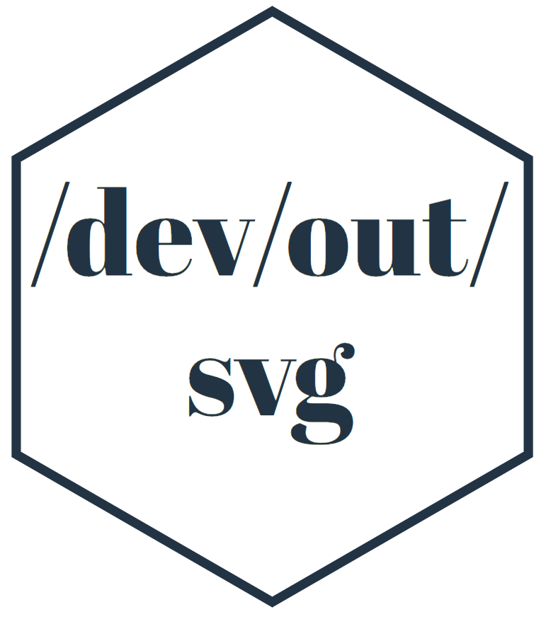

<!-- badges: start -->


<!-- badges: end -->

`devoutsvg` provides a bespoke SVG graphics device written in plain R.


Because github sanitises SVG to remove some elements of style, scripting and animation,
please see the [devoutsvg pkgdown website](https://coolbutuseless.github.io/package/devoutsvg/index.html)
to view the animations.

#### Key Features

* Behaves like a normal graphic output device
* Written in plain R (making use of [devout](https://github.com/coolbutuseless/devout) for the interface to C)
* Can use pattern fills for area - either using raw SVG, `minisvg` documents or
  packages such as:
    * [`svgpatternsimple`](https://github.com/coolbutuseless/svgpatternsimple) for simple repeating stripes and dots etc
    * [`svgpatternusgs`](https://github.com/coolbutuseless/svgpatternusgs) for geological patterns from the [USGS](//usgs.gov)
* Can include Javascript to further customise the output.


#### What's New

* Complete refactor of how pattern fills are specified.  This used to be via
  packages which provided patterns, but is now done directly in a `pattern_list`
  object supplied by the user when the `svgout` device is called.


#### Future

* Work out a convenient way to specify CSS, Javascript and SVG on individual elements
  within the plot.
  
#### Warning

This package is still **very** experimental.  The means of specifying CSS, javascript,
patterns and filters will evolve.

## Installation

You can install from [GitHub](https://github.com/coolbutuseless/devoutsvg) with:

``` r
# install.packages("devtools")
devtools::install_github("coolbutuseless/minisvg")   # SVG creation
devtools::install_github("coolbutuseless/devout")    # Device interface
devtools::install_github("coolbutuseless/devoutsvg") # This package
```
## Using the `svgout` device

Use this device in the same way you would use `pdf()`, `png()` any of the other
graphics output devices in R.


```{r svgout_example}
#~~~~~~~~~~~~~~~~~~~~~~~~~~~~~~~~~~~~~~~~~~~~~~~~~~~~~~~~~~~~~~~~~~~~~~~~~~~~~~
# Create a very boring plot
#~~~~~~~~~~~~~~~~~~~~~~~~~~~~~~~~~~~~~~~~~~~~~~~~~~~~~~~~~~~~~~~~~~~~~~~~~~~~~~
example_plot <- ggplot(mtcars) + 
  geom_density(aes(mpg, fill = as.factor(cyl))) +
  labs(title = "Example `devoutsvg::svgout()` device output") + 
  theme_bw() +    
  scale_fill_manual(values = c('4' = '#df536b', '6' = '#61d04f', '8' = '#2297e6'))
  
#~~~~~~~~~~~~~~~~~~~~~~~~~~~~~~~~~~~~~~~~~~~~~~~~~~~~~~~~~~~~~~~~~~~~~~~~~~~~~~
# Output the plot to the `svgout` device
#~~~~~~~~~~~~~~~~~~~~~~~~~~~~~~~~~~~~~~~~~~~~~~~~~~~~~~~~~~~~~~~~~~~~~~~~~~~~~~
devoutsvg::svgout(filename = "man/figures/svgout-example.svg", width = 8, height = 4)
  example_plot
invisible(dev.off())
```

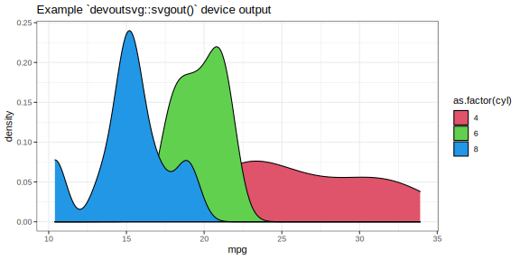


## Filling with patterns

In comparison to standard SVG output devices (such as 
`svg` and `svglite`) this device has options to modify and 
insert SVG into the output.

The `svgout` device can be instructed to use patterns instead of the actual RGB 
colour - this is achieved by 

1. Defining a pattern through either:
    * Providing SVG in a text string
    * A `minisvg` object
2. Creating a named list associating a hex colour with a pattern
3. Passing this named list to the `svgout` device.
  


```{r define_patterns}
#~~~~~~~~~~~~~~~~~~~~~~~~~~~~~~~~~~~~~~~~~~~~~~~~~~~~~~~~~~~~~~~~~~~~~~~~~~~~~~
# 1. Define a pattern
#~~~~~~~~~~~~~~~~~~~~~~~~~~~~~~~~~~~~~~~~~~~~~~~~~~~~~~~~~~~~~~~~~~~~~~~~~~~~~~
pattern_gear4 <- svgpatternsimple::create_pattern_stipple(
  id           = 'stipple',
  colour       = '#61d04f', 
  spacing      = 10
)

pattern_gear6 <- svgpatternsimple::create_pattern_hex(
  id            = 'hex',
  angle         = 0, 
  spacing       = 20, 
  fill_fraction = 0.1,
  colour        = '#2297e6'
)
```

```{r echo=FALSE}
plist <- minisvg::SVGPatternList_to_svg(list(pattern_gear4, pattern_gear6), 
                                        width = 400, height = 200)
plist$save("man/figures/patterns.svg")
```

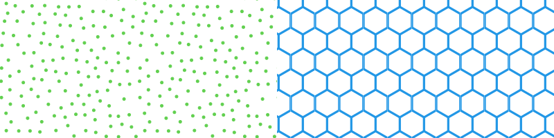


```{r pattern_manual}
#~~~~~~~~~~~~~~~~~~~~~~~~~~~~~~~~~~~~~~~~~~~~~~~~~~~~~~~~~~~~~~~~~~~~~~~~~~~~~~
# 2. Create a named list associating a hex colour with a pattern to fill with
#~~~~~~~~~~~~~~~~~~~~~~~~~~~~~~~~~~~~~~~~~~~~~~~~~~~~~~~~~~~~~~~~~~~~~~~~~~~~~~
my_pattern_list <- list(
  '#61d04f' = list(fill = pattern_gear4),
  '#2297e6' = list(fill = pattern_gear6)
)

#~~~~~~~~~~~~~~~~~~~~~~~~~~~~~~~~~~~~~~~~~~~~~~~~~~~~~~~~~~~~~~~~~~~~~~~~~~~~~~
# 3. Pass this named `pattern_list` to the `svgout` device
#~~~~~~~~~~~~~~~~~~~~~~~~~~~~~~~~~~~~~~~~~~~~~~~~~~~~~~~~~~~~~~~~~~~~~~~~~~~~~~
svgout(filename = "man/figures/example-manual.svg", width = 8, height = 4,
       pattern_list = my_pattern_list)

  example_plot + 
    labs(title = "Example - manual pattern specification")
  
invisible(dev.off())
```

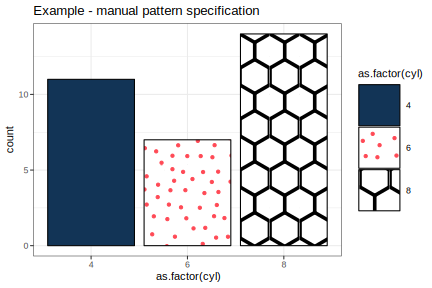


## Applying an SVG filter to a object

The `svgout` device can be instructed to apply an SVG filter to a region. Filters can 
be applied in addition to patterns.

1. Defining a pattern/filter through either:
    * Providing SVG in a text string
    * A `minisvg` object
2. Creating a named list associating a hex colour with a pattern
3. Passing this named list to the `svgout` device.
  


```{r define_filter}
#~~~~~~~~~~~~~~~~~~~~~~~~~~~~~~~~~~~~~~~~~~~~~~~~~~~~~~~~~~~~~~~~~~~~~~~~~~~~~~
# 1. Define a pattern
#~~~~~~~~~~~~~~~~~~~~~~~~~~~~~~~~~~~~~~~~~~~~~~~~~~~~~~~~~~~~~~~~~~~~~~~~~~~~~~
pattern_gear4 <- svgpatternsimple::create_pattern_gradient(
  id           = 'fire_gradient',
  colour1      = 'red', 
  colour2      = 'gold',
  angle        = 90
)

pattern_gear6 <- svgpatternsimple::create_pattern_hex(
  id            = 'hex',
  angle         = 0, 
  spacing       = 20, 
  fill_fraction = 0.1,
  colour        = '#2297e6'
)

fire_filter <- svgfilter::create_filter_turbulent_displacement(
  id = "fire1"
)
```


```{r filter_example}
#~~~~~~~~~~~~~~~~~~~~~~~~~~~~~~~~~~~~~~~~~~~~~~~~~~~~~~~~~~~~~~~~~~~~~~~~~~~~~~
# 2. Create a named list associating a hex colour with a pattern to fill with
#~~~~~~~~~~~~~~~~~~~~~~~~~~~~~~~~~~~~~~~~~~~~~~~~~~~~~~~~~~~~~~~~~~~~~~~~~~~~~~
my_pattern_list <- list(
  '#61d04f' = list(fill = pattern_gear4, filter = fire_filter),
  '#2297e6' = list(fill = pattern_gear6)
)

#~~~~~~~~~~~~~~~~~~~~~~~~~~~~~~~~~~~~~~~~~~~~~~~~~~~~~~~~~~~~~~~~~~~~~~~~~~~~~~
# 3. Pass this named `pattern_list` to the `svgout` device
#~~~~~~~~~~~~~~~~~~~~~~~~~~~~~~~~~~~~~~~~~~~~~~~~~~~~~~~~~~~~~~~~~~~~~~~~~~~~~~
svgout(filename = "man/figures/example-filter.svg", width = 8, height = 4,
       pattern_list = my_pattern_list)

  example_plot + 
    labs(title = "Example - patterns + filters")
  
invisible(dev.off())
```



## Including javascript to customise a plot

The following example includes the [D3](https://d3js.org/) javascript library and includes javascript
code to manipulate the plot.  You don't have to include any javascript libraries 
if you don't want - and you can just write raw javascript to manipulate the DOM.

Note: because github removes js/css from SVG objects a screenshot of the resulting
SVG is included.

```{r}
my_js_code <- "  
d3.select('#polygon-0001').style('fill', null);
d3.select('#polygon-0003').style('stroke-width', 10);
"

svgout(filename = "man/figures/example-javascript.svg", width = 8, height = 4,
       js_url = "https://d3js.org/d3.v5.min.js", js_code = my_js_code)

  example_plot + 
    labs(title = "Example - javascript (D3)")
  
invisible(dev.off())
```

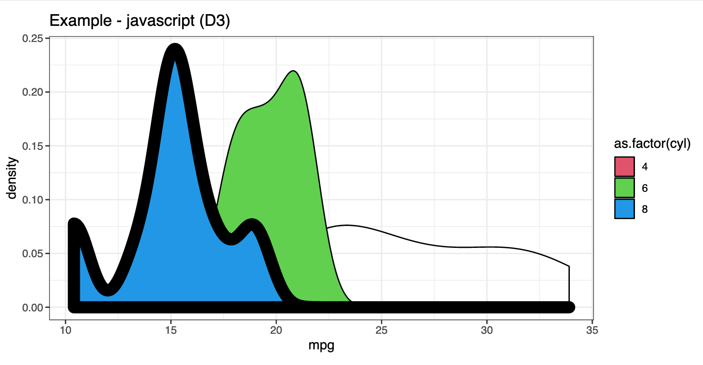


## Including CSS to customise a plot

The following example includes the [animate.css](https://daneden.github.io/animate.css/) 
CSS library and includes CSS declarations to apply these styles to some objects.


You don't have to include any CSS libraries 
if you don't want - and you can just write raw CSS to style the DOM.

Note: because github removes js/css from SVG objects a screenshot of the resulting
SVG is included.

```{r}
my_css_decl <- "  
@keyframes pulse {
  from {transform: scale3d(1, 1, 1);}
  50%  {transform: scale3d(1.15, 1.15, 1.15);}
  to   {transform: scale3d(1, 1, 1);}
}

#polygon-0003 {
  animation-name: pulse;
  animation-duration: 4s;
  animation-fill-mode: both;
  animation-iteration-count: infinite;
}

rect:hover {
  fill: green !important;
}
"

svgout(filename = "man/figures/example-css.svg", width = 8, height = 4,
       css_decl = my_css_decl)

  example_plot + 
    labs(title = "Example - CSS")
  
invisible(dev.off())
```

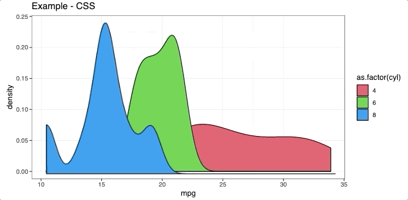


## More examples of patterns and filters


<details><summary style='color: #4169E1;'>Show R code for the base `pie` graph (click to open/close) </summary>

```{r base_plots}
my_pattern_list <- list(
  `#000001` = list(
    fill = svgpatternsimple::create_pattern_stipple(
      id      = 'stipple',
      colour  = '#ff4455', 
      spacing = 10
    )),
  
  `#000002` = list(
    fill = svgpatternsimple::create_pattern_hex(
      id      = 'hex',
      colour  = '#ddff55', 
      spacing = 8
    )),
  
  `#000003` = list(
    fill = svgpatternsimple::create_pattern_check(
      id      = 'check',
      colour  = '#ee55ff', 
      spacing = 10
    )
  )
)

colours <- c('tomato', '#000001', '#000002', '#000003')

devoutsvg::svgout(filename = "man/figures/example-pie.svg", width = 4, height = 4,
                  pattern_list = my_pattern_list)
    pie(c(cool = 4, but = 2, use = 1, less = 8), col = colours)
invisible(dev.off())
```

</details>


<details><summary style='color: #4169E1;'>Show R code for USGS plot (click to open/close) </summary>

```{r warning=FALSE}
library(sf)
library(svgpatternusgs)

#~~~~~~~~~~~~~~~~~~~~~~~~~~~~~~~~~~~~~~~~~~~~~~~~~~~~~~~~~~~~~~~~~~~~~~~~~~~~~
# Select some data
#~~~~~~~~~~~~~~~~~~~~~~~~~~~~~~~~~~~~~~~~~~~~~~~~~~~~~~~~~~~~~~~~~~~~~~~~~~~~~
nc <- sf::st_read(system.file("shape/nc.shp", package = "sf"), quiet = TRUE)
nc$mid <- sf::st_centroid(nc$geometry)
nc <- nc[nc$NAME %in% c('Surry', 'Stokes', 'Rockingham', 'Yadkin', 'Forsyth', 'Guilford'), ]

#~~~~~~~~~~~~~~~~~~~~~~~~~~~~~~~~~~~~~~~~~~~~~~~~~~~~~~~~~~~~~~~~~~~~~~~~~~~~~
# Encode specific USGS pattern numbers into colours
#~~~~~~~~~~~~~~~~~~~~~~~~~~~~~~~~~~~~~~~~~~~~~~~~~~~~~~~~~~~~~~~~~~~~~~~~~~~~~
my_pattern_list <- list(
  `#000001` = list(fill = svgpatternusgs::create_usgs_pattern(usgs_code = 601, spacing = 100, fill='#77ff99')),
  `#000002` = list(fill = svgpatternusgs::create_usgs_pattern(usgs_code = 606, spacing = 100)),
  `#000003` = list(fill = svgpatternusgs::create_usgs_pattern(usgs_code = 629, spacing = 100)),
  `#000004` = list(fill = svgpatternusgs::create_usgs_pattern(usgs_code = 632, spacing = 100)),
  `#000005` = list(fill = svgpatternusgs::create_usgs_pattern(usgs_code = 706, spacing = 100)),
  `#000006` = list(fill = svgpatternusgs::create_usgs_pattern(usgs_code = 717, spacing = 100))
)

devoutsvg::svgout(filename = "man/figures/example-usgs.svg", width = 6, height = 4,
                  pattern_list = my_pattern_list)
ggplot(nc) +
  geom_sf(aes(fill = NAME)) +
  scale_fill_manual(values = names(my_pattern_list)) + 
  theme(legend.key.size = unit(0.6, "cm")) + 
  labs(title = "U.S. Geological Survey Patterns with `geom_sf()`") +
  theme_bw()
invisible(dev.off())
```
</details>


<details><summary style='color: #4169E1;'>Show R code for retro plot (click to open/close) </summary>
```{r}
my_pattern_list <- list(
  `#000001` = list(fill = svgpatternsimple::create_pattern_stripe(id = 'pattern1', spacing =  5, fill_fraction = 0.7, angle =   0)),
  `#000002` = list(fill = svgpatternsimple::create_pattern_stripe(id = 'pattern2', spacing =  5, fill_fraction = 0.7, angle =  45)),
  `#000003` = list(fill = svgpatternsimple::create_pattern_stripe(id = 'pattern3', spacing =  5, fill_fraction = 0.7, angle = 135)),
  `#000004` = list(fill = svgpatternsimple::create_pattern_hatch (id = 'pattern4', spacing =  7, fill_fraction = 0.2, angle =   0)),
  `#000005` = list(fill = svgpatternsimple::create_pattern_hatch (id = 'pattern5', spacing =  7, fill_fraction = 0.2, angle =  45)),
  `#000006` = list(fill = svgpatternsimple::create_pattern_dot   (id = 'pattern6', spacing =  4, fill_fraction = 0.8, angle =   0)),
  `#000007` = list(fill = svgpatternsimple::create_pattern_dot   (id = 'pattern7', spacing =  8, fill_fraction = 0.7))
)


devoutsvg::svgout(filename = "man/figures/example-retro.svg", width = 6, height = 4, 
                  pattern_list = my_pattern_list)
ggplot(mpg) +
  geom_bar(aes(class, fill=class), colour='black') + 
  theme_bw() + 
  theme(
    panel.grid = element_blank(),
    text       = element_text(size=12,  family="Courier New", face = 'bold'),
    legend.position = 'none'
  ) + 
  scale_fill_manual(values = names(my_pattern_list))
invisible(dev.off())
```
</details>


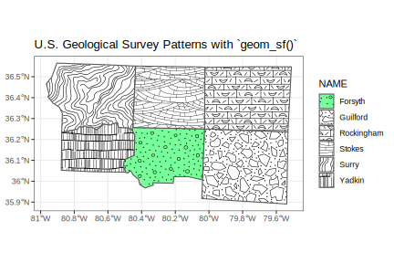
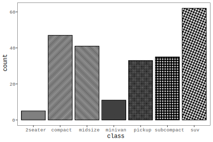
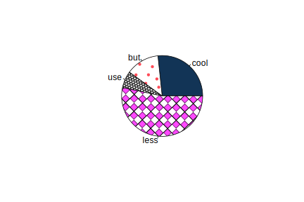


<div style="clear: both;" />


## Real-world examples

#### Left - Death trends

The following was created by [VictimOfMaths](https://twitter.com/VictimOfmaths)
to compare deaths over time based upon [UK ONS data](https://www.ons.gov.uk/peoplepopulationandcommunity/healthandsocialcare/healthandwellbeing/articles/middleagedgenerationmostlikelytodiebysuicideanddrugpoisoning/2019-08-13).

The original code is on [VictimOfMaths github](), and a modified version is 
included as a vignette (`vignette('svg-with-gradient-fill', package = 'devoutsvg')`) - see 
also the [online devoutsvg documentation](https://coolbutuseless.github.io/package/devoutsvg/articles/svg-with-gradient-fill.html)


#### Right - Fire Season Workloads

A similar approach was used by [MilesMcbain](https://twitter.com/MilesMcBain) to 
create this plot of fire season workloads:

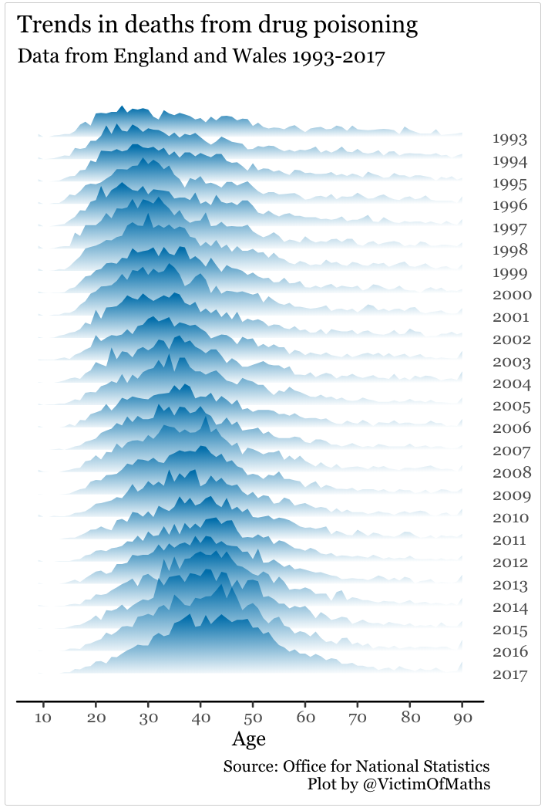
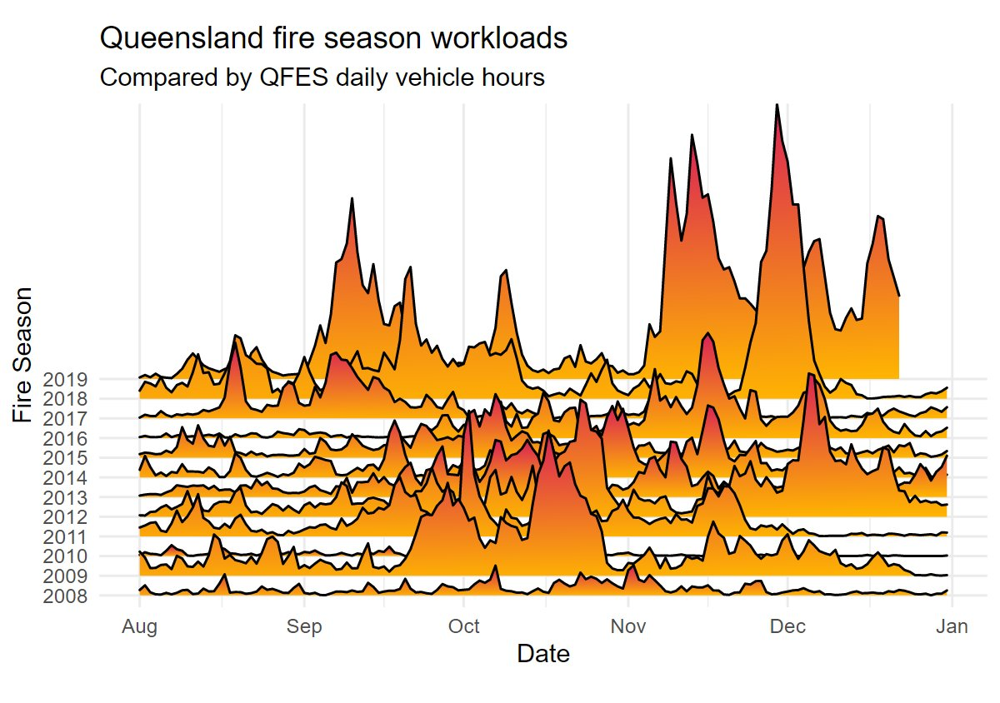

<div style="clear: both;" />


## Convert SVG to PDF

If you need a PDF version of an SVG file, there are a number of options.

1. [Inkscape](https://inkscape.org/)
2. `rsvg` on the command line 
    * `rsvg-convert -f pdf -o t.pdf t.svg`
3. `CairoSVG` on the command line (python based)
    * `cairosvg in.svg -o out.pdf`
4. `Imagemagick` (not 100% sure)
    * `convert file.svg file.pdf `
5. `Chrome` headless (maybe?)
    * `chrome --headless --disable-gpu --print-to-pdf="output.pdf" "input.svg"`
6. Web-based. There are lots of these e.g.
    * [https://cloudconvert.com/svg-to-pdf](https://cloudconvert.com/svg-to-pdf)


## Creating the logo for this package

Note: Because github sanitizes SVG files it makes the SVG produced in this section
unviewable.  Instead, the SVG was first saved, and then rendered to PNG

<details><summary style='color: #4169E1;'>Show R code for logo (click to open/close) </summary>
```{r}
library(minisvg)
#~~~~~~~~~~~~~~~~~~~~~~~~~~~~~~~~~~~~~~~~~~~~~~~~~~~~~~~~~~~~~~~~~~~~~~~~~~~~~
# Building an SVG logo with an animated stripe
#~~~~~~~~~~~~~~~~~~~~~~~~~~~~~~~~~~~~~~~~~~~~~~~~~~~~~~~~~~~~~~~~~~~~~~~~~~~~~
logo <- svg_doc(width = 200, height = 200)$
  update(width=NULL, height=NULL)

#~~~~~~~~~~~~~~~~~~~~~~~~~~~~~~~~~~~~~~~~~~~~~~~~~~~~~~~~~~~~~~~~~~~~~~~~~~~~~
# Background White Rect
#~~~~~~~~~~~~~~~~~~~~~~~~~~~~~~~~~~~~~~~~~~~~~~~~~~~~~~~~~~~~~~~~~~~~~~~~~~~~~
logo$rect(x=0, y=0, width="100%", height="100%", fill='white')


#~~~~~~~~~~~~~~~~~~~~~~~~~~~~~~~~~~~~~~~~~~~~~~~~~~~~~~~~~~~~~~~~~~~~~~~~~~~~~
# Create a hexagon filled, and add it to the document
#~~~~~~~~~~~~~~~~~~~~~~~~~~~~~~~~~~~~~~~~~~~~~~~~~~~~~~~~~~~~~~~~~~~~~~~~~~~~~
len     <- 95
angles  <- (seq(0, 360, 60) + 90) * pi/180
xs      <- round(len * cos(angles) + 100, 2)
ys      <- round(len * sin(angles) + 100, 2)
hex     <- stag$polygon(id = 'hex', xs = xs, ys = ys)
hex$update(stroke = '#223344', fill_opacity=0, stroke_width = 3)
logo$append(hex)


#~~~~~~~~~~~~~~~~~~~~~~~~~~~~~~~~~~~~~~~~~~~~~~~~~~~~~~~~~~~~~~~~~~~~~~~~~~~~~
# Text label
#~~~~~~~~~~~~~~~~~~~~~~~~~~~~~~~~~~~~~~~~~~~~~~~~~~~~~~~~~~~~~~~~~~~~~~~~~~~~~
text1 <- stag$text(
  "/dev/out/",
  class = "mainfont",
  x = 22, y = 90
)

text2 <- stag$text(
  "svg",
  class = "mainfont",
  x = 72, y = 135
)

logo$append(text1)
logo$append(text2)


#~~~~~~~~~~~~~~~~~~~~~~~~~~~~~~~~~~~~~~~~~~~~~~~~~~~~~~~~~~~~~~~~~~~~~~~~~~~~~
# Load CSS for google font and specify styling for 'mainfont'
#~~~~~~~~~~~~~~~~~~~~~~~~~~~~~~~~~~~~~~~~~~~~~~~~~~~~~~~~~~~~~~~~~~~~~~~~~~~~~
logo$add_css_url("https://fonts.googleapis.com/css?family=Abril%20Fatface")
logo$add_css("
.mainfont {
  font-size: 38px;
  font-family: 'Abril Fatface', sans-serif;
  fill: #223344;
}
")

#~~~~~~~~~~~~~~~~~~~~~~~~~~~~~~~~~~~~~~~~~~~~~~~~~~~~~~~~~~~~~~~~~~~~~~~~~~~~~
# output
#~~~~~~~~~~~~~~~~~~~~~~~~~~~~~~~~~~~~~~~~~~~~~~~~~~~~~~~~~~~~~~~~~~~~~~~~~~~~~
# logo$show()
logo$save("man/figures/logo.svg")
```
</details>


```{r echo=FALSE, results='asis'}
cat(
  "<pre>",
  "<details><summary style='color: #4169E1;'> Show/hide SVG text </summary>",
  htmltools::htmlEscape(as.character(logo)),
  "</details>",
  "</pre>", sep='')
```


