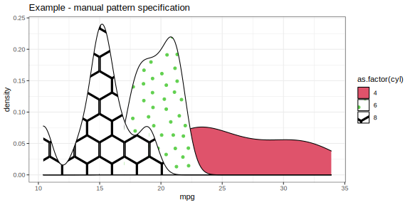
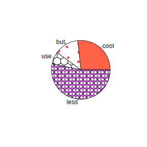
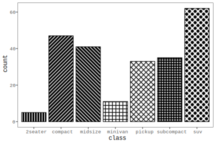

<!-- README.md is generated from README.Rmd. Please edit that file -->

```{r, include = FALSE}
knitr::opts_chunk$set(
  collapse = TRUE,
  comment = "#>",
  fig.path = "man/figures/README-"
)


set.seed(1)

suppressPackageStartupMessages({
  library(dplyr)
  library(devout)
  library(devoutsvg)
  library(ggplot2)
  library(sf)
  library(svgpatternusgs)
})
```


```{r echo = FALSE, eval = FALSE}
# Quick logo generation. Borrowed heavily from Nick Tierney's Syn logo process
library(magick)
library(showtext)
font_add_google("Abril Fatface", "gf")


# pkgdown::build_site(override = list(destination = "../coolbutuseless.github.io/package/devoutsvg"))
```


```{r echo = FALSE, eval = FALSE}
img <- image_read("man/figures/white.png")


hexSticker::sticker(subplot  = img,
                    s_x      = 0.92,
                    s_y      = 1,
                    s_width  = 1.5,
                    s_height = 0.95,
                    package  = "/dev/out/\nsvg",
                    p_x      = 1,
                    p_y      = 1,
                    p_color  = "#223344",
                    p_family = "gf",
                    p_size   = 9,
                    h_size   = 1.2,
                    h_fill   = "#ffffff",
                    h_color  = "#223344",
                    filename = "man/figures/logo.png")

image_read("man/figures/logo.png")
```


# devoutsvg   

<!-- badges: start -->


<!-- badges: end -->

`devoutsvg` provides a bespoke SVG graphics device written in plain R.

The key feature of this SVG graphics device is that it allowd for the use of
patterns for filled regions in plots!


## Installation

You can install from [GitHub](https://github.com/coolbutuseless/devoutsvg) with:

``` r
# install.packages("devtools")
devtools::install_github("coolbutuseless/lofi")      # Colour encoding
devtools::install_github("coolbutuseless/minisvg")   # SVG creation
devtools::install_github("coolbutuseless/devout")    # Device interface
devtools::install_github("coolbutuseless/devoutsvg") # This package
```
## Basic usage of the `svgout` device

Use this device in the same way you would use `pdf()`, `png()` any of the other
graphics output devices in R.

This results is thankfully uninteresting! That is, if the `svgout` device works
properly then the output should like the standard ggplot output you've seen
hundreds of times before.


```{r svgout}
devoutsvg::svgout(filename = "man/figures/example-basic.svg")
ggplot(mtcars) + 
  geom_point(aes(mpg, wt, colour = as.factor(cyl))) + 
  labs(title = basename("Example - Basic")) 
invisible(dev.off())
```


## Filling with patterns

Because we now have control over the graphics device at quite a low level, we
get to misbehave!

The `svgout` device can be instructed to use patterns instead of the actual RGB 
colour - this is achieved by 

* instructing the device to use a particular pattern package (`pattern_pkg`), and 
* encoding particular patterns from that package as their RGB representations using 
  `{pattern_pkg}::encode_pattern_params_as_hex_colour()`
  
When `svgout` is asked to render a colour, it instead asks `pattern_pkg` to `**decode**hex_colour_as_pattern_params`
and returns the desired SVG pattern snippet.

Some examples of pattern packages are:

* [`svgpatternsimple`](https://github.com/coolbutuseless/svgpatternsimple)
* [`svgpatternusgs`](https://github.com/coolbutuseless/svgpatternusgs)


```{r pattern_manual}
library(svgpatternsimple)

#~~~~~~~~~~~~~~~~~~~~~~~~~~~~~~~~~~~~~~~~~~~~~~~~~~~~~~~~~~~~~~~~~~~~~~~~~~~~~~
# Encode the parameters for 3 different patterns into 3 different colours
#~~~~~~~~~~~~~~~~~~~~~~~~~~~~~~~~~~~~~~~~~~~~~~~~~~~~~~~~~~~~~~~~~~~~~~~~~~~~~~
gear4_colour <- svgpatternsimple::encode_pattern_params_as_hex_colour(
  pattern_name = 'null', 
  colour       = '#123456'
)

gear6_colour <- svgpatternsimple::encode_pattern_params_as_hex_colour(
  pattern_name = 'stipple', 
  colour       = '#ff4455', 
  spacing      = 10
)

gear8_colour <- svgpatternsimple::encode_pattern_params_as_hex_colour(
  pattern_name  = 'hex', 
  angle         = 0, 
  spacing       = 20, 
  fill_fraction = 0.1,
  colour        = '#125634'
)

c(gear4_colour, gear6_colour, gear8_colour)


svgout(filename = "man/figures/example-manual.svg", pattern_pkg = 'svgpatternsimple')
ggplot(mtcars) + 
  geom_bar(aes(as.factor(cyl), fill = as.factor(cyl)), colour = 'black') + 
  labs(title = basename("Example - manual pattern specification")) + 
  theme_bw() +
  theme(legend.key.size = unit(1.5, "cm")) + 
  scale_fill_manual(
    values = c(
      '4' = gear4_colour,
      '6' = gear6_colour,
      '8' = gear8_colour
    )
  )
invisible(dev.off())
```





##  Using `scale_fill_pattern_simple()`

Rather than specifying individual patterns to map to colours, you can use a `scale_fill`.
Since RGB colours don't intuitively map to patterns, if you let ggplot choose the patterns
using the default `scale_fill_discrete()` you will get a pretty ugly combination of 
patterns in your plot.

`scale_fill_pattern_simple()` allows the user to specify the envelope of desired outputs 
and ggplot will map values-to-patterns automatically within this envelope.

By default this will give an OK spread of pattern styles, but it probably won't be great.  
See the next section for how to specify the desired envelope of possible patterns.

```{r scale_fill_2}
svgout(pattern_pkg = 'svgpatternsimple', filename = "man/figures/example-scale-fill-2.svg")
ggplot(mtcars) + 
  geom_bar(aes(as.factor(cyl), fill = as.factor(cyl)), colour = 'black') + 
  labs(title = "scale_fill_pattern_simple() - defaults") + 
  theme_bw() +
  theme(legend.key.size = unit(1.5, "cm")) +
  svgpatternsimple::scale_fill_pattern_simple()
invisible(dev.off())
```


## Using `scale_fill_pattern_simple()` with a defined pattern set.

By default `scale_fill_pattern_simple()` will give an OK spread of pattern styles, but it probably won't be great. 

The call to `scale_fill_pattern_simple()` can be customised to limit the possible 
choices of pattern which will appear in the plot.  The default options are as follows:

* `pattern_name = c('stripe', 'dot', 'hatch', 'check', 'stipple', 'hex')`
* `angle = c(22., 45, 67.5)`
* `spacing = seq(5, 50, length.out = 7)`
* `fill_fraction = seq(0.1, 0.9, length.out = 3)`

In this following example, the choice of possible patterns is limited to 'stripe' and 'hatch', 
all at 45 degrees, with a range of `fill_fraction` and `spacing`

```{r svgout_multi, warning=FALSE}
svgout(pattern_pkg = 'svgpatternsimple', filename = "man/figures/example-patternsimple-scale-fill.svg",
       width = 8, height = 6)
ggplot(mtcars) + 
  geom_density(aes(mpg, fill = interaction(cyl, am)), alpha = 1) +
  theme_bw() +
  theme(legend.key.size = unit(1.2, "cm")) +
  labs(title = "scale_fill_pattern_simple() - custom") +
  svgpatternsimple::scale_fill_pattern_simple(
    pattern_name  = c('stripe', 'hatch'),
    fill_fraction = seq(0.1, 0.4, length.out = 5), 
    angle         = c(45), 
    spacing       = c(10, 20)) 
invisible(dev.off())
```


## Pattern fills with base plots

```{r base_plots}

colours <- c(
  svgpatternsimple::encode_pattern_params_as_hex_colour(
    pattern_name = 'null', 
    colour       = '#123456'
  ),
  
  svgpatternsimple::encode_pattern_params_as_hex_colour(
    pattern_name = 'stipple', 
    colour       = '#ff4455', 
    spacing      = 10
  ),
  
  svgpatternsimple::encode_pattern_params_as_hex_colour(
    pattern_name = 'hex', 
    colour       = '#ddff55', 
    spacing      = 8
  ),
  
  svgpatternsimple::encode_pattern_params_as_hex_colour(
    pattern_name = 'check', 
    colour       = '#ee55ff', 
    spacing      = 10
  )
)


devoutsvg::svgout(pattern_pkg = 'svgpatternsimple', filename = "man/figures/example-pie.svg")
pie(c(cool = 4, but = 2, use = 1, less = 8), col = colours)
invisible(dev.off())
```




## U.S. Geological Survey patterns on `geom_sf()` plots

The following plot uses the SVG pattern library made available in [`svgpatternusgs`](https://github.com/coolbutuseless/svgpatternusgs).

The 6 areas are manually assigned a colour which corresponds to a set of pattern params. 
The parameters are encoded to a colour by the `encode_pattern_params_as_hex_colour()` function
in the `svgpatternusgs` package.


```{r warning=FALSE}
library(sf)
library(svgpatternusgs)

#~~~~~~~~~~~~~~~~~~~~~~~~~~~~~~~~~~~~~~~~~~~~~~~~~~~~~~~~~~~~~~~~~~~~~~~~~~~~~
# Select some data
#~~~~~~~~~~~~~~~~~~~~~~~~~~~~~~~~~~~~~~~~~~~~~~~~~~~~~~~~~~~~~~~~~~~~~~~~~~~~~
nc <- sf::st_read(system.file("shape/nc.shp", package = "sf"), quiet = TRUE)
nc$mid <- sf::st_centroid(nc$geometry)
nc <- nc[nc$NAME %in% c('Surry', 'Stokes', 'Rockingham', 'Yadkin', 'Forsyth', 'Guilford'), ]

#~~~~~~~~~~~~~~~~~~~~~~~~~~~~~~~~~~~~~~~~~~~~~~~~~~~~~~~~~~~~~~~~~~~~~~~~~~~~~
# Encode specific USGS pattern numbers into colours
#~~~~~~~~~~~~~~~~~~~~~~~~~~~~~~~~~~~~~~~~~~~~~~~~~~~~~~~~~~~~~~~~~~~~~~~~~~~~~
colours <- c(
  Surry      = svgpatternusgs::encode_pattern_params_as_hex_colour(usgs_code = 601, spacing = 100, fill='#77ff99'),
  Stokes     = svgpatternusgs::encode_pattern_params_as_hex_colour(usgs_code = 606, spacing = 100),
  Rockingham = svgpatternusgs::encode_pattern_params_as_hex_colour(usgs_code = 629, spacing = 100),
  Yadkin     = svgpatternusgs::encode_pattern_params_as_hex_colour(usgs_code = 632, spacing = 100),
  Forsyth    = svgpatternusgs::encode_pattern_params_as_hex_colour(usgs_code = 706, spacing = 100),
  Guilford   = svgpatternusgs::encode_pattern_params_as_hex_colour(usgs_code = 717, spacing = 100)
)

devoutsvg::svgout(filename = "man/figures/example-usgs.svg", pattern_pkg = 'svgpatternusgs')
ggplot(nc) +
  geom_sf(aes(fill = NAME)) +
  scale_fill_manual(values = colours) + 
  theme(legend.key.size = unit(0.6, "cm")) + 
  labs(title = "U.S. Geological Survey Patterns with `geom_sf()`") +
  theme_bw()
invisible(dev.off())
```


## Retro plotting


```{r}
f <- svgpatternsimple::encode_pattern_params_as_hex_colour

colours <- c(
  `2seater`  = f(pattern_name = 'stripe', spacing =  5, fill_fraction = 0.7, angle = 0),
  compact    = f(pattern_name = 'stripe', spacing =  5, fill_fraction = 0.7, angle = 45),
  midsize    = f(pattern_name = 'stripe', spacing =  5, fill_fraction = 0.7, angle = 135),
  minivan    = f(pattern_name = 'hatch' , spacing =  7, fill_fraction = 0.2, angle = 0),
  pickup     = f(pattern_name = 'hatch' , spacing =  7, fill_fraction = 0.2, angle = 45),
  subcompact = f(pattern_name = 'dot'   , spacing =  4, fill_fraction = 0.8, angle = 0),
  suv        = f(pattern_name = 'dot'   , spacing =  8, fill_fraction = 0.7)
)


devoutsvg::svgout(filename = "man/figures/example-retro.svg", pattern_pkg = 'svgpatternsimple')
ggplot(mpg) +
  geom_bar(aes(class, fill=class), colour='black') + 
  theme_bw() + 
  theme(
    panel.grid = element_blank(),
    text       = element_text(size=12,  family="Courier New", face = 'bold'),
    legend.position = 'none'
  ) + 
  scale_fill_manual(values = colours)
invisible(dev.off())
```





## Real-world examples

The following was created by [VictimOfMaths](https://twitter.com/VictimOfmaths)
to compare deaths over time based upon [UK ONS data](https://www.ons.gov.uk/peoplepopulationandcommunity/healthandsocialcare/healthandwellbeing/articles/middleagedgenerationmostlikelytodiebysuicideanddrugpoisoning/2019-08-13).

The original code is on [VictimOfMaths github](), and a modified version is 
included as a vignette (`vignette('svg-with-gradient-fill', package = 'devoutsvg')`) - see 
also the [online devoutsvg documentation](https://coolbutuseless.github.io/package/devoutsvg/articles/svg-with-gradient-fill.html)


A similar approach was used by [MilesMcbain](https://twitter.com/MilesMcBain) to 
create this plot of fire season workloads:


## Convert SVG to PDF

If you need a PDF version of an SVG file, there are a number of options.

1. [Inkscape](https://inkscape.org/)
2. `rsvg` on the command line 
    * `rsvg-convert -f pdf -o t.pdf t.svg`
3. `CairoSVG` on the command line (python based)
    * `cairosvg in.svg -o out.pdf`
4. `Imagemagick` (not 100% sure)
    * `convert file.svg file.pdf `
5. `Chrome` headless (maybe?)
    * `chrome --headless --disable-gpu --print-to-pdf="output.pdf" "input.svg"`
6. Web-based. There are lots of these e.g.
    * [https://cloudconvert.com/svg-to-pdf](https://cloudconvert.com/svg-to-pdf)


