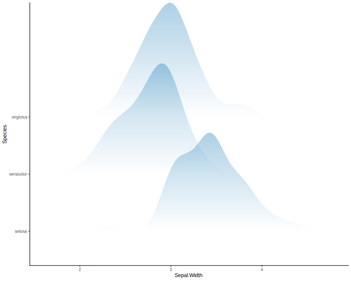

```{r, include = FALSE}
knitr::opts_chunk$set(
  collapse = TRUE,
  comment = "#>"
)

dir.create("svg", showWarnings = FALSE)
```

```{r setup, warning=FALSE,message=FALSE}
#~~~~~~~~~~~~~~~~~~~~~~~~~~~~~~~~~~~~~~~~~~~~~~~~~~~~~~~~~~~~~~~~~~~~~~~~~~~~
# install devout and its dependencies
#
# svgpatternsimple - a set of simple patterns in SVG
# devout           - Framework for creating graphics devices in plain R
# devoutsvg        - Custom SVG device
#~~~~~~~~~~~~~~~~~~~~~~~~~~~~~~~~~~~~~~~~~~~~~~~~~~~~~~~~~~~~~~~~~~~~~~~~~~~~
# devtools::install_github("coolbutuseless/svgpatternsimple") 
# devtools::install_github("coolbutuseless/devout")    
# devtools::install_github("coolbutuseless/devoutsvg") 

suppressPackageStartupMessages({
  library(devout)
  library(devoutsvg)
  library(svgpatternsimple)
  
  library(dplyr)
  library(tidyr)
  library(ggplot2)
  library(ggridges)
})
```


# Deaths Of Drug Poisoning

This vignette recreates a plot with vertical colour gradient.   It was developed by
[VictimOfMaths](https://twitter.com/VictimOfMaths) and the complete version is 
available on [github](https://github.com/VictimOfMaths/DeathsOfDespair).

The image below on the left is from the [UK Office for National Statistics (ONS)](https://www.ons.gov.uk/peoplepopulationandcommunity/healthandsocialcare/healthandwellbeing/articles/middleagedgenerationmostlikelytodiebysuicideanddrugpoisoning/2019-08-13).

The image on the right is created using `R`, `ggplot` and `devoutsvg`

<div>


</div>
<div style="clear:both;" />


# Simple gradient example

Create, view, debug and iterate to find a gradient fill of your liking.

```{r}
#~~~~~~~~~~~~~~~~~~~~~~~~~~~~~~~~~~~~~~~~~~~~~~~~~~~~~~~~~~~~~~~~~~~~~~~~~~~~
# Create SVG gradient pattern definition
#~~~~~~~~~~~~~~~~~~~~~~~~~~~~~~~~~~~~~~~~~~~~~~~~~~~~~~~~~~~~~~~~~~~~~~~~~~~~
grad <- svgpatternsimple::create_gradient_pattern(
  id      = "p1",      # HTML/SVG id to assign to this pattern
  angle   = 90,        # Direction of the gradient
  colour1 = "White",   # Starting colour
  colour2 = "#0570b0"  # Final colour
)

# Contents of 'grad' pattern
#> <linearGradient id="p1" x1="0%" y1="100%" x2="0%" y2="0%">
#>   <stop style="stop-color:White;stop-opacity:1" offset="0%" />
#>   <stop style="stop-color:#0570b0;stop-opacity:1" offset="100%" />
#> </linearGradient>

# Visualise in viewer in Rstudio
# grad$show()
```


```{r echo = FALSE, eval = FALSE}
if (interactive()) {
  grad$show()
} 
grad$save_full_svg("svg/gradient-example.svg", height=100, include_declaration = FALSE)
```


```{r}
#~~~~~~~~~~~~~~~~~~~~~~~~~~~~~~~~~~~~~~~~~~~~~~~~~~~~~~~~~~~~~~~~~~~~~~~~~~~~
# Encode the parameters of tis pattern into a RGB hex triplet.
# This colour will be unpacked during the plotting process and turned back 
# in to a gradient
#~~~~~~~~~~~~~~~~~~~~~~~~~~~~~~~~~~~~~~~~~~~~~~~~~~~~~~~~~~~~~~~~~~~~~~~~~~~~
gradRGB <- svgpatternsimple::encode_pattern_params_as_hex_colour(
  pattern_name = "gradient",
  angle        = 90, 
  colour1      = "White", 
  colour2      = "#0570b0"
)   

gradRGB
```


```{r eval=TRUE}
#~~~~~~~~~~~~~~~~~~~~~~~~~~~~~~~~~~~~~~~~~~~~~~~~~~~~~~~~~~~~~~~~~~~~~~~~~~~~
# Render the graph to the 'svgout' device and nominate any patterns to be 
# rendered by the 'svgpatternsimple' package
#~~~~~~~~~~~~~~~~~~~~~~~~~~~~~~~~~~~~~~~~~~~~~~~~~~~~~~~~~~~~~~~~~~~~~~~~~~~~
svgout(filename = "svg/test-gradient.svg", pattern_pkg="svgpatternsimple")
  ggplot(iris, aes(x=Sepal.Width, y=Species)) +
  geom_density_ridges(alpha=0.33, scale=2, fill=gradRGB, colour=alpha(0.1)) +
  theme_classic()
invisible(dev.off())    
```





# Recreate the ONS Plot

* Grab the raw data from the ONS
* Reshape into tidy form
* Create a `ggridges` plot
    * Use the `devoutsvg` device with `svgpatternsimple`
    * Use the encoded gradient created above (i.e. `gradRGB`) as the 
      fill colour for the ridges.
      

```{r warning=FALSE, eval=TRUE}
#~~~~~~~~~~~~~~~~~~~~~~~~~~~~~~~~~~~~~~~~~~~~~~~~~~~~~~~~~~~~~~~~~~~~~~~~~~~~
# Read (and cache) the data from the ONS 
#~~~~~~~~~~~~~~~~~~~~~~~~~~~~~~~~~~~~~~~~~~~~~~~~~~~~~~~~~~~~~~~~~~~~~~~~~~~~
# drugs <- readr::read_csv("https://www.ons.gov.uk/visualisations/dvc661/drugs/datadownload.csv"   )
# saveRDS(drugs, "data/drugs.rds")
drugs <- readRDS("data/drugs.rds")

#~~~~~~~~~~~~~~~~~~~~~~~~~~~~~~~~~~~~~~~~~~~~~~~~~~~~~~~~~~~~~~~~~~~~~~~~~~~~
# Tidy + reshape data
#~~~~~~~~~~~~~~~~~~~~~~~~~~~~~~~~~~~~~~~~~~~~~~~~~~~~~~~~~~~~~~~~~~~~~~~~~~~~
drugs <- drugs %>%
  mutate(
    Age = case_when(
      Age   == "<10" ~ "9",
      Age   == "90+" ~ "90",
      TRUE  ~  Age
    )
  ) %>%
  tidyr::gather("Year", "Deaths", -Age) %>%
  mutate(
    Age  = as.integer(Age),
    Year = as.integer(Year)
  )


#~~~~~~~~~~~~~~~~~~~~~~~~~~~~~~~~~~~~~~~~~~~~~~~~~~~~~~~~~~~~~~~~~~~~~~~~~~~~
# Render the graph to the 'svgout' device and nominate any fill colours to be 
# rendered by the 'svgpatternsimple' package
#~~~~~~~~~~~~~~~~~~~~~~~~~~~~~~~~~~~~~~~~~~~~~~~~~~~~~~~~~~~~~~~~~~~~~~~~~~~~
svgout(filename = "svg/DrugDeaths.svg", pattern_pkg="svgpatternsimple", width=4, height=6)
ggplot(drugs, aes(Age, Year, height=Deaths, group=Year)) +
  geom_density_ridges(stat='identity', scale = 3, colour=NA, fill=gradRGB) + 
  scale_y_reverse(position = 'right', breaks = sort(unique(drugs$Year))) +
  scale_x_continuous(breaks = seq(10, 90, 10)) +
  theme_classic() +
  theme(
    axis.line.y  = element_blank(), 
    axis.ticks.y = element_blank(), 
    axis.title.y = element_blank(),
    text         = element_text(family="Georgia")
  ) +
  labs(
    title    = "Trends in deaths from drug poisoning",
    subtitle = "Data from England and Wales 1993-2017",
    caption  = "Source: Office for National Statistics\nPlot by @VictimOfMaths"
  )
invisible(dev.off())
```


